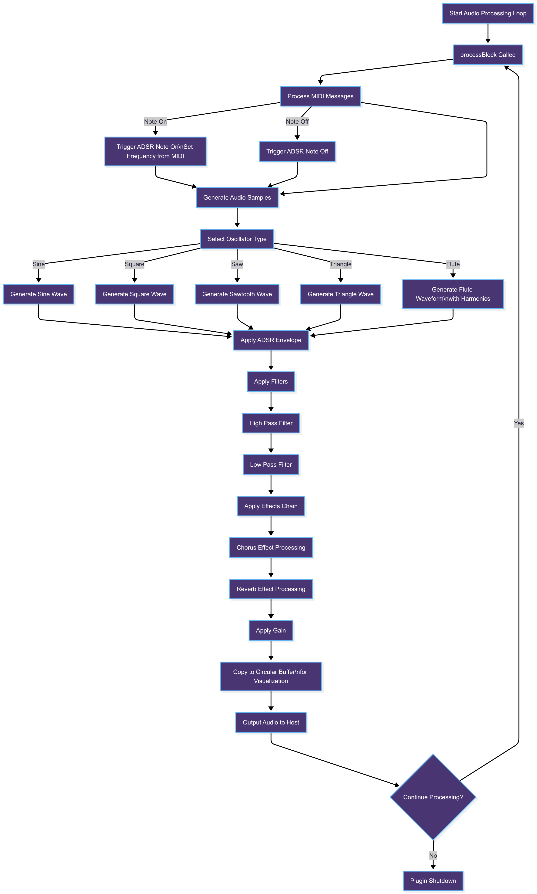
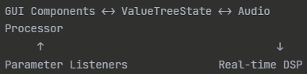

## Architecture Overview (Modules, Class Structure)

### 1. Class Structure 

- **PluginProcessor**  
  Main class for audio processing and plugin integration.

- **PluginEditor**  
  GUI manager that assembles and displays the various UI components.

- **MysticalLookAndFeel**  
  Defines the appearance and behavior of UI elements (custom look & feel).

- **ADSRComponent**  
  Visualizes and controls the envelope parameters (Attack, Decay, Sustain, Release).

- **WaveformComponent**  
  Displays the oscillator waveform.

- **ChorusEffect/ ChorusComponent / ReverbComponent /SpectrumComponent**  
  Implement the respective audio effects and their GUIs.

---

## 2. Signal Processing Overview 

The core of the synthesizer's sound generation and manipulation lies in its Digital Signal Processing (DSP) components. These components handle the generation, shaping, and effects applied to the audio signal in real-time.

Key DSP components include:

- **Oscillators**: Generate basic waveforms (sine, square, sawtooth, etc.) that serve as the sound source.
- **ADSR Envelope**: Controls the amplitude envelope of the sound, shaping how the sound evolves over time through Attack, Decay, Sustain, and Release phases.
- **Effects Modules**: Such as Chorus and Reverb, which add spatial and modulation effects to enrich the sound.
- **Filter and Modulation**: Components that alter the frequency content and dynamics of the audio signal.

These DSP modules are interconnected within the audio processing pipeline to produce the final synthesized output heard by the user.

### 2.1 Signal Flow
MIDI Input  
↓  
Note Detection  
↓  
Frequency Calculation  
↓  
Oscillator  
↓  
Raw Waveform Generation  
↓  
ADSR Envelope (Dynamic Amplitude Control)  
↓  
Filter Chain  
&nbsp;&nbsp;├─ HighPass  
&nbsp;&nbsp;└─ LowPass  
↓  
Chorus Effect (Delay + LFO Modulation)  
↓  
Reverb Effect (Spatial Processing)  
↓  
Gain Control (Final Volume)  
↓  
Audio Output + Circular Buffer (Visualization)

### 2.2 Parameter Sync

---

## 3. GUI

- **Preset Button**: Resets all settings to a preset designed to emulate the enchanting sound of a magical flute.
- **Gain Slider**: Controls the overall output volume.
- **Frequency Slider**: Adjusts oscillator frequency.
- **Oscillator ComboBox**: Chooses waveform types.
- **Filter Controls**: Modify the filter parameters.
- **Mystical Background Image**: Visual theme element (`Pan.jpg`).
- **ADSR Component**: Custom Attack-Decay-Sustain-Release envelope editor.
- **Chorus and Reverb Components**: Add modulation and spatial effects.
- **MIDI Keyboard**: For note input via mouse or MIDI hardware.
- **Waveform Visualization**: Displays the generated waveform in real time.
- **Spectrum Analyzer**: Shows the frequency spectrum of the output.

<pre style="font-family: 'Courier New', Consolas, monospace;">
┌─────────────────────────────┬──────────────┐
│ Preset Button               │ picture      │
├─────────────────────────────┤ (Pan.jpg)    │
│ Frequency Slider            │              │
├─────────────────────────────┤              │
│ Oscillator ComboBox         │              │
├─────────────────────────────┼──────────────┤
│ Filter Controls             │              │
├─────────────────────────────┴──────────────┤
│ ADSR Component (Custom)                    │
├────────────────┬───────────────────────────┤
│ Chorus         │ Reverb                    │
│ Component      │ Component                 │
├────────────────┴───────────────────────────┤
│ MIDI Keyboard                              │
├────────────────────────────────────────────┤
│ Waveform Visualization                     │
├────────────────────────────────────────────┤
│ Spectrum Analyzer                          │
└────────────────────────────────────────────┘
</pre>

---

## 4. Special Features

### 4.1 Custom Developed Components

1. **ADSRComponent**
  - Fully interactive graphical ADSR envelope
  - Real-time manipulation via drag & drop
  - Quadratic scaling for natural parameter distribution

2. **ChorusEffect**
  - Standalone chorus implementation featuring:
    - Circular DelayLine buffer
    - Linear interpolation for smooth modulation
    - Feedback loop for intensity control

3. **ReverbComponent**
  - Custom-developed reverb effect
  - Parameters for room size, damping, wet/dry mix
  - Designed for realistic spatial acoustics

4. **SpectrumComponent**
  - Self-written FFT-based spectrum analyzer
  - Logarithmic frequency scaling
  - Real-time frequency visualization

5. **Mystical Design System**
  - Procedurally generated gradients and glow effects
  - Adaptive color scheme based on component state
  - Integration of external artwork (Pan.jpg)

### 4.2 Performance Optimizations

- **ScopedNoDenormals**: Prevents denormalization issues in audio calculations
- **Circular Buffer**: Efficient visualization without memory reallocation
- **Parameter Smoothing**: Linear ramping to avoid audio artifacts during parameter changes
- **Timer-based GUI**: 60 FPS update rate for smooth visual feedback

### 4.3 Flute Preset System

An intelligent preset architecture featuring:

- **Waveform Simulation**: Mathematically modeled flute harmonics
- **ADSR Profile**: Realistic attack and release characteristics
- **Filter Setup**: Authentic frequency response
- **Reverb Configuration**: Concert hall-like spatial acoustics

---

## 5. extern Libraries

This project relies on the following external libraries, which are automatically downloaded and integrated during the build process via CMake's FetchContent:

- **JUCE Framework (version 8.0.8)**  
  A comprehensive C++ framework for developing audio applications and plugins. It provides core modules for audio processing, DSP algorithms, plugin hosting (AU, VST3, Standalone), and GUI components.  
  JUCE is linked as `juce_audio_utils` and `juce_dsp` in this project.

- **magic_enum (version 0.9.7)**  
  A modern, header-only C++ library enabling compile-time reflection of enum types. It simplifies parameter management by automatically generating string representations of enums without runtime overhead.

Both libraries are included as dependencies through CMake's FetchContent module, ensuring seamless download, configuration, and integration without manual setup.
